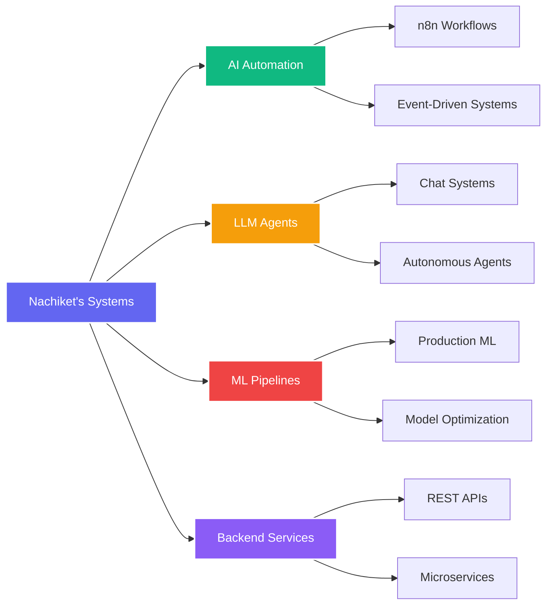

<h1 align="center">
  
</h1>

<div align="center">
  
[](mailto:nachiketshinde2004@gmail.com)
[](https://linkedin.com/in/nachiket-shinde2004)
[](https://nachiket.kodeneurons.tech)
[](https://www.kodeneurons.tech)
[](https://www.youtube.com/@KodeNeurons)


</div>


### 👨‍💻 About Me

🎓 **Computer Science & Engineering**  
🤖 **AI Automation Engineer**  
🧠 **Machine Learning Engineer**  
🚀 **LLM Systems Builder**  
🏢 **Co-Founder** @ KodeNeurons  

I specialize in building **production-ready AI systems** that automate workflows, deploy intelligent agents, and scale reliably.  
My work focuses on **impact first**, not demos.

```python
class Nachiket:
    def __init__(self):
        self.role = "AI Automation & ML Engineer"
        self.education = "Computer Science & Engineering"
        self.company = "KodeNeurons (Co-Founder)"
        self.mission = "Automate first. Optimize later. Scale intelligently."
        
    def expertise(self):
        return {
            "🤖 AI Automation": "LLM-powered workflows & agents",
            "🧠 ML Engineering": "Production ML pipelines",
            "⚙️ Backend Systems": "Scalable APIs & microservices",
            "💬 LLM Systems": "RAG, agents, orchestration",
            "📚 Knowledge Sharing": "YouTube & technical content"
        }
    
    def current_focus(self):
        return [
            "Autonomous LLM agents",
            "RAG optimization",
            "AI workflow orchestration",
            "Scalable AI system design"
        ]

nachiket = Nachiket()
```

<br clear="right"/>

---

## 🔥 Core Philosophy

<div align="center">

| 🎯 Principle | 💡 Meaning |
|:---:|:---:|
| **Automate First** | Eliminate repetitive manual work |
| **Optimize Later** | Focus on business impact, not premature optimization |
| **Scale Intelligently** | Build systems that grow without breaking |
| **Production Ready** | Real users, real reliability, no demos |

</div>

---


## 🛠️ Technology Stack

<div align="center">

### AI & Machine Learning


### LLM & AI Frameworks


### Backend & Databases


### Automation & DevOps


### Programming Languages


</div>


## 🧠 What I Build

<div align="center">



</div>

<br>

<table align="center">
<tr>
<td align="center" width="25%">

<br><b>AI Automation</b>
<br>Workflow orchestration
<br>Intelligent agents
<br>Event-driven systems
</td>
<td align="center" width="25%">

<br><b>LLM Systems</b>
<br>Chat interfaces
<br>RAG pipelines
<br>Agent frameworks
</td>
<td align="center" width="25%">

<br><b>ML Engineering</b>
<br>Model training
<br>Optimization
<br>Deployment
</td>
<td align="center" width="25%">

<br><b>Backend Systems</b>
<br>Scalable APIs
<br>Database design
<br>Authentication
</td>
</tr>
</table>

---


## 🚀 Entrepreneurship & Impact

<div align="center">

### 🧠 Co-Founder – KodeNeurons
**AI Automation & ML Solutions**

</div>

<table align="center">
<tr>
<td align="center" width="25%">

<br><b>AI Products</b>
<br>Building AI-powered<br>automation products
</td>
<td align="center" width="25%">

<br><b>LLM Systems</b>
<br>Designing production-grade<br>LLM applications
</td>
<td align="center" width="25%">

<br><b>Business Scale</b>
<br>Helping businesses scale<br>with intelligent workflows
</td>
<td align="center" width="25%">

<br><b>Community</b>
<br>Sharing real-world<br>AI knowledge
</td>
</tr>
</table>

<div align="center">

**What We Do:**
- 🤖 Design and implement AI-driven automation systems
- 🧠 Develop LLM-powered agents and intelligent workflows
- ⚙️ Create production-ready ML pipelines for real-world applications
- 📺 Produce educational content on AI automation and system building
- 🌐 Build scalable backend services with AI integration

[](https://www.kodeneurons.tech)
[](https://www.youtube.com/@KodeNeurons)

</div>

---


## 🌟 Featured Work

<table>
<tr>
<td width="33%">

### 🤖 AI Automation Systems
**Enterprise workflow orchestration**

**Features:**
- ⚙️ n8n workflow orchestration
- 🤖 LLM-powered decision agents
- 🔗 API & SaaS integrations
- 📊 Event-driven systems

**Stack:** `n8n` `LangChain` `FastAPI` `MongoDB`

</td>
<td width="33%">

### 🧠 LLM Chat Systems
**Intelligent conversational AI**

**Highlights:**
- 💬 Multi-turn conversations
- 🔍 Context-aware RAG pipelines
- ⚡ Real-time inference
- 📚 Knowledge base integration

**Stack:** `LangChain` `Gemini API` `Flask` `PostgreSQL`

</td>
<td width="33%">

### 🔄 ML Engineering
**Production ML pipelines**

**Achievements:**
- 🎯 Automated training workflows
- 📈 Model versioning & tracking
- 🔍 Performance monitoring
- 🚀 Deployment-ready systems

**Stack:** `Python` `TensorFlow` `Docker` `FastAPI`

</td>
</tr>
</table>

---


## 📊 GitHub Analytics

<br/>

<div align="center">
  
</div>
<div align="center">  </div>
---


## 💡 What Drives Me

<div align="center">

> *"The thrill of building AI systems that work reliably in production — not just demos, but real solutions that scale and create impact."*

I combine **engineering precision**, **AI innovation**, and **automation expertise** to build technology that matters. From LLM-powered agents to production ML pipelines, I'm always pushing boundaries and solving real-world problems.

<table>
<tr>
<td align="center" width="33%">

<br><b>Production First</b>
<br><sub>Real users, real reliability</sub>
</td>
<td align="center" width="33%">

<br><b>Innovation Focused</b>
<br><sub>Pushing AI boundaries</sub>
</td>
<td align="center" width="33%">

<br><b>Impact Driven</b>
<br><sub>Scale intelligently</sub>
</td>
</tr>
</table>

</div>

---


## 🤝 Open to Opportunities

<div align="center">


### 💼 Actively Seeking Roles:

**🤖 AI Automation Engineer**  
**🧠 Machine Learning Engineer**  
**💬 LLM / AI Systems Engineer**

I'm looking for opportunities where I can build **production-ready AI systems**, design **intelligent automation workflows**, and deploy **scalable ML solutions** that drive real business impact.

---

### 🌟 Looking For:

<table align="center">
<tr>
<td align="center" width="25%">

<br><b>Full-Time Roles</b>
<br><sub>AI/ML & Automation Engineering</sub>
</td>
<td align="center" width="25%">

<br><b>Collaborations</b>
<br><sub>Innovative AI projects</sub>
</td>
<td align="center" width="25%">

<br><b>Freelance Work</b>
<br><sub>LLM & automation consulting</sub>
</td>
<td align="center" width="25%">

<br><b>Mentorship</b>
<br><sub>Learning & growing together</sub>
</td>
</tr>
</table>

---

**Let's build intelligent systems together! 🚀**

---

### 📬 Get In Touch

<div align="center">

**Whether you're hiring, collaborating, or just curious — I'd love to talk tech!**

<br>

[](mailto:nachiketshinde2004@gmail.com)
[](https://linkedin.com/in/nachiket-shinde2004)
[](https://nachiket.kodeneurons.tech)
[](https://www.kodeneurons.tech)
[](https://www.youtube.com/@KodeNeurons)

<br>

**📧 nachiketshinde2004@gmail.com**
**📍 Chhatrapati Sambhajinagar, Maharashtra, India**

</div>

</div>

---

<div align="center">

### 💙 Support My Work

If you find my projects helpful or interesting:

<table align="center">
<tr>
<td align="center">⭐ Star my repositories</td>
<td align="center">📺 Subscribe to YouTube</td>
<td align="center">🔗 Connect on LinkedIn</td>
<td align="center">🌐 Visit KodeNeurons</td>
</tr>
</table>

<br>


<br>

**Made with ❤️ by Nachiket Shinde**  
*Co-Founder @ KodeNeurons*

<br>

> *"Automate first. Optimize later. Scale intelligently."*

<br>

[](https://visitorbadge.io/status?path=Nachiket858)

</div>


