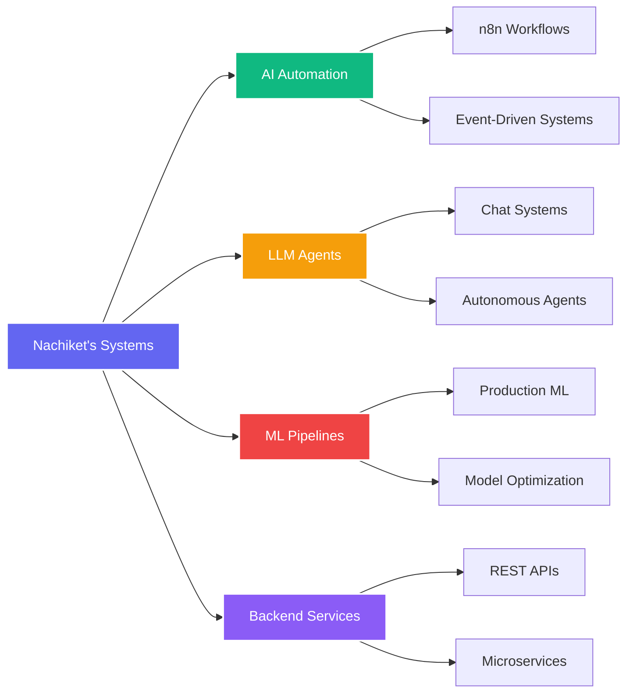

<h1 align="center">
  
</h1>

<div align="center">
  
[](mailto:nachiketshinde2004@gmail.com)
[](https://linkedin.com/in/nachiket-shinde2004)
[](https://nachiket.kodeneurons.in)
[](https://www.kodeneurons.in)
[](https://www.youtube.com/@KodeNeurons)


</div>

<br>

<picture>
  <source media="(min-width: 1024px)" srcset="https://user-images.githubusercontent.com/74038190/229223263-cf2e4b07-2615-4f87-9c38-e37600f8381a.gif" width="400" align="right">
  
</picture>

### 👨‍💻 About Me

🎓 **Computer Science & Engineering**  
🤖 **AI Automation Engineer**  
🧠 **Machine Learning Engineer**  
🚀 **LLM Systems Builder**  
🏢 **Co-Founder** @ KodeNeurons  

I specialize in building **production-ready AI systems** that automate workflows, deploy intelligent agents, and scale reliably. My work focuses on **impact first**, not demos.

```python
class Nachiket:
    def __init__(self):
        self.role = "AI Automation & ML Engineer"
        self.education = "Computer Science & Engineering"
        self.company = "KodeNeurons (Co-Founder)"
        self.mission = "Automate first. Optimize later. Scale intelligently."
        
    def expertise(self):
        return {
            "🤖 AI Automation": "LLM-powered workflows & agents",
            "🧠 ML Engineering": "Production ML pipelines",
            "⚙️ Backend Systems": "Scalable APIs & microservices",
            "💬 LLM Systems": "RAG, agents, orchestration",
            "📚 Knowledge Sharing": "YouTube & technical content"
        }
    
    def current_focus(self):
        return [
            "Autonomous LLM agents",
            "RAG optimization",
            "AI workflow orchestration",
            "Scalable AI system design"
        ]

nachiket = Nachiket()
```

<br clear="all"/>

---

## 🔥 Core Philosophy

<div align="center">

| 🎯 Principle | 💡 Meaning |
|:---:|:---:|
| **Automate First** | Eliminate repetitive manual work |
| **Optimize Later** | Focus on business impact, not premature optimization |
| **Scale Intelligently** | Build systems that grow without breaking |
| **Production Ready** | Real users, real reliability, no demos |

</div>

---

<picture>
  <source media="(min-width: 768px)" srcset="https://user-images.githubusercontent.com/74038190/212284100-561aa473-3905-4a80-b561-0d28506553ee.gif">
  
</picture>

## 🛠️ Technology Stack

### 🤖 AI & Machine Learning

<p align="center">


</p>

### 💬 LLM & AI Frameworks

<p align="center">


</p>

### ⚙️ Backend & Databases

<p align="center">


</p>

### 🔧 Automation & DevOps

<p align="center">


</p>

### 💻 Programming Languages

<p align="center">


</p>

<picture>
  <source media="(min-width: 768px)" srcset="https://user-images.githubusercontent.com/74038190/212284100-561aa473-3905-4a80-b561-0d28506553ee.gif">
  
</picture>

## 🧠 What I Build

<div align="center">



</div>

<br>

<details open>
<summary><h3>🎯 Core Capabilities</h3></summary>

<br>

**🤖 AI Automation**
- Workflow orchestration
- Intelligent agents
- Event-driven systems

**💬 LLM Systems**
- Chat interfaces
- RAG pipelines
- Agent frameworks

**🧠 ML Engineering**
- Model training
- Optimization
- Deployment

**⚙️ Backend Systems**
- Scalable APIs
- Database design
- Authentication

</details>

---

<picture>
  <source media="(min-width: 768px)" srcset="https://user-images.githubusercontent.com/74038190/212284100-561aa473-3905-4a80-b561-0d28506553ee.gif">
  
</picture>

## 🚀 Entrepreneurship & Impact

<div align="center">

### 🧠 Co-Founder – KodeNeurons
**AI Automation & ML Solutions**

</div>

<details open>
<summary><h3>💼 What We Do</h3></summary>

<br>

- 🤖 **AI Products** - Building AI-powered automation products
- 🧠 **LLM Systems** - Designing production-grade LLM applications
- ⚙️ **Business Scale** - Helping businesses scale with intelligent workflows
- 📺 **Community** - Sharing real-world AI knowledge

<div align="center">

[](https://www.kodeneurons.in)
[](https://www.youtube.com/@KodeNeurons)

</div>

</details>

---

<picture>
  <source media="(min-width: 768px)" srcset="https://user-images.githubusercontent.com/74038190/212284100-561aa473-3905-4a80-b561-0d28506553ee.gif">
  
</picture>

## 🌟 Featured Work

<details open>
<summary><h3>🤖 AI Automation Systems</h3></summary>

**Enterprise workflow orchestration**

**Features:**
- ⚙️ n8n workflow orchestration
- 🤖 LLM-powered decision agents
- 🔗 API & SaaS integrations
- 📊 Event-driven systems

**Stack:** `n8n` `LangChain` `FastAPI` `MongoDB`

</details>

<details>
<summary><h3>🧠 LLM Chat Systems</h3></summary>

**Intelligent conversational AI**

**Highlights:**
- 💬 Multi-turn conversations
- 🔍 Context-aware RAG pipelines
- ⚡ Real-time inference
- 📚 Knowledge base integration

**Stack:** `LangChain` `Gemini API` `Flask` `PostgreSQL`

</details>

<details>
<summary><h3>🔄 ML Engineering</h3></summary>

**Production ML pipelines**

**Achievements:**
- 🎯 Automated training workflows
- 📈 Model versioning & tracking
- 🔍 Performance monitoring
- 🚀 Deployment-ready systems

**Stack:** `Python` `TensorFlow` `Docker` `FastAPI`

</details>

---

<picture>
  <source media="(min-width: 768px)" srcset="https://user-images.githubusercontent.com/74038190/212284100-561aa473-3905-4a80-b561-0d28506553ee.gif">
  
</picture>

## 📊 GitHub Analytics

<br/>

<div align="center">
  <picture>
    <source media="(min-width: 768px)" srcset="https://github-profile-summary-cards.vercel.app/api/cards/profile-details?username=Nachiket858&theme=tokyonight">
    
  </picture>
</div>

<br>

<div align="center">
  <picture>
    <source media="(min-width: 768px)" srcset="https://github-readme-activity-graph.vercel.app/graph?username=Nachiket858&custom_title=Nachiket's%20Contribution%20Graph&bg_color=0D1117&color=6366F1&line=6366F1&point=FFFFFF&area_color=0D1117&area=true&hide_border=true">
    
  </picture>
</div>

---

<picture>
  <source media="(min-width: 768px)" srcset="https://user-images.githubusercontent.com/74038190/212284100-561aa473-3905-4a80-b561-0d28506553ee.gif">
  
</picture>

## 💡 What Drives Me

<div align="center">

> *"The thrill of building AI systems that work reliably in production — not just demos, but real solutions that scale and create impact."*

I combine **engineering precision**, **AI innovation**, and **automation expertise** to build technology that matters. From LLM-powered agents to production ML pipelines, I'm always pushing boundaries and solving real-world problems.

<br>

### 🎯 My Principles

**Production First** • Real users, real reliability  
**Innovation Focused** • Pushing AI boundaries  
**Impact Driven** • Scale intelligently

</div>

---

<picture>
  <source media="(min-width: 768px)" srcset="https://user-images.githubusercontent.com/74038190/212284100-561aa473-3905-4a80-b561-0d28506553ee.gif">
  
</picture>

## 🤝 Open to Opportunities

<div align="center">

<picture>
  <source media="(min-width: 768px)" srcset="https://user-images.githubusercontent.com/74038190/216644497-1951db19-8f3d-4e44-ac08-8e9d7e0d94a7.gif" width="200">
  
</picture>

### 💼 Actively Seeking Roles:

**🤖 AI Automation Engineer**  
**🧠 Machine Learning Engineer**  
**💬 LLM / AI Systems Engineer**

I'm looking for opportunities where I can build **production-ready AI systems**, design **intelligent automation workflows**, and deploy **scalable ML solutions** that drive real business impact.

</div>

---

### 🌟 Looking For:

<div align="center">

**Full-Time Roles** • AI/ML & Automation Engineering  
**Collaborations** • Innovative AI projects  
**Freelance Work** • LLM & automation consulting  
**Mentorship** • Learning & growing together

<br>

**Let's build intelligent systems together! 🚀**

</div>

---

### 📬 Get In Touch

<div align="center">

**Whether you're hiring, collaborating, or just curious — I'd love to talk tech!**

<br>

[](mailto:nachiketshinde2004@gmail.com)
[](https://linkedin.com/in/nachiket-shinde2004)
[](https://nachiket.kodeneurons.in)
[](https://www.kodeneurons.in)
[](https://www.youtube.com/@KodeNeurons)

<br>

**📧 nachiketshinde2004@gmail.com**  
**📍 Chhatrapati Sambhajinagar, Maharashtra, India**

</div>

---

<div align="center">

### 💙 Support My Work

If you find my projects helpful or interesting:

⭐ Star my repositories • 📺 Subscribe to YouTube • 🔗 Connect on LinkedIn • 🌐 Visit KodeNeurons

<br>

<picture>
  <source media="(min-width: 768px)" srcset="https://user-images.githubusercontent.com/74038190/212284087-bbe7e430-757e-4901-90bf-4cd2ce3e1852.gif" width="100">
  
</picture>

<br>

**Made with ❤️ by Nachiket Shinde**  
*Co-Founder @ KodeNeurons*

<br>

> *"Automate first. Optimize later. Scale intelligently."*

<br>

[](https://visitorbadge.io/status?path=Nachiket858)

</div>

<picture>
  <source media="(min-width: 768px)" srcset="https://capsule-render.vercel.app/api?type=waving&color=gradient&customColorList=6,11,20&height=100&section=footer">
  
</picture>
